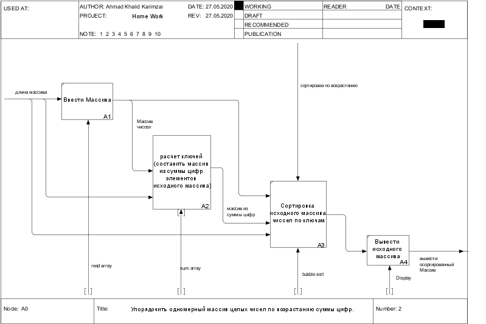

**1.Постановки задачи:
 Условие задачи:**
```
Упорядочить одномерный массив целых чисел по возрастанию суммы цифр.

1. Допущения:
* Размер массива не больше 100;

2. Примеры работы.
сначала программа считает сумм чисел и сохраняет их в другой массив если число отрецательный то программа 
умножает его на -1 потом с помощю массив из суммых чисел сортирует массив.

|      | размер  |Ввод                  |    Вывод              |
|------|---------|----------------------|-----------------------|
| 1.   |  fg     |Пустой массив         | Пустой массив         |
| 2.   |  gh     | -                    | ошибка                |
| 3.   |  6      |dds df s dsf sdf sd   | ошибка                |
| 4.   |  4      |123 24 25 26          | 123 24 25 26          |
| 5.   |  6      |10 7 9 11 12 58       | 10 11 12 7 9 58       |
| 6.   |  5      |999 100 21 37 272     | 100 21 37 272 999     |
| 7.   |  7      |370 123 7 907 3 44 31 | 3 31 123 7 44 370 907 |
| 8.   |  6      |-23 12 23 -34 24 -14  | 12 -23 23 -14 24 -34  |

```
**2. Декомпозиция**




**Тесты для подзадачи Sum_array**

```
• Массив чисел.

Предполагается, что на входе получает корректно введённый массив.

| #   | Проверяемый случай  | Значения                | Результать         |
|-----|---------------------|-------------------------|--------------------|
| 1.  | Отрицательные числа | -34 -4 -1 -3 -567       | 7 4 1 3 18         |
|     |                     | -13 -2 -4 -34 -5 -4 -3  | 4 2 4 7 5 4 3      |
| 2.  | Положительные числа |  12 45 3 2 1 7 8 56 100 | 3 9 3 2 1 7 8 11 1 |
|     |                     | 100 23 3 99 8 754 12    | 1 5 3 18 8 16 3    |
| 3.  | кривой ввод         | sd sd asd asd asd       | ошибка             |
```
**• Блок А22**
```
| Имя              | Numbers                                 |
|------------------|-----------------------------------------|
| Функция          | Делит число на цифры и считает их сумму |
| Параметры        | Число, сумма цифр числа                 |
| Входные данные   | Число                                   |
| Выходные данные  | Сумма цифр числа                        |
| Внешние эффектый |   -                                     |
```

**Тесты для подзадачи Numbers**

```
Принимает только положительные числа.
• Число

| №  | Проверяемый случай | Значение | Результать |
|----|--------------------|----------|------------|
| 1. | Целые              |          |            |
|    | Положительные      | 982      |  9 8 2     |
|    |                    | 12       | 1 2        |
|    |                    | 5        | 5          |
|    |                    | 0        | 0          |
```
**• Блок А3**
```
| Имя             | Bubble_sort                                          |
|-----------------|------------------------------------------------------|
| Функция         | Сортирует массив по ключам массива сумм цифр         |
| Параметры       | Массив сумм цифр,  Массив чисел, длина массива чисел |
| Входные данные  | Массив сумм цифр,  Массив чисел, длина массива чисел |
| Выходные данные | Массив чисел, Массив сумм цифр                       |
| Внешние эффекты |  -                                                   |
```
**Тесты для подзадачи Bubble_sort**

```
Предполагается, что на входе корректный Массив

• Массив сумм цифр.

| №   | Проверяемый случай     | Значение              | Результать            |
|-----|------------------------|-----------------------|-----------------------|
| 1.  | Один элемент массива   | 12                    | 12                    |
| 2.  | Осортированный массив  | 12 13 26 37 48 69 199 | 12 13 26 37 48 69 199 |
| 3.  | Обратно осортированный | 199 69 48 37 26 13 12 | 12 13 26 37 48 69 199 |
| 4.  | Рандомный массив       | 1 9 2 8 3 7 4 65      | 1 2 3 4 7 8 9 65      |
|     |                        | 3 2 4 1 5             | 1 2 3 4 5             |
|     |                        | 5 6 4 2 2 8 11 2 43   | 2 2 2 4 5 6 8 11 43   |
```
```
• Массив чисел
| №   | Проверяемый случай     | Значение            | Результать             |
|-----|------------------------|---------------------|------------------------|
| 1.  | Один элемент массива   | 3                   | 3                      |
| 2.  | Осортированный массив  | 2 3 7 14 35 55 78   | 2 3 7 14 36 55 78      |
| 3.  | Обратно осортированный | 99 54 32 30 21 13 2 | 2 13 21 30 32 44 54 99 |
| 4.  | Рандомный массив       | 1 9 2 8 3 7 4 65    | 1 2 3 4 5 6 7 8 9      |
|     |                        | 3 2 4 1 5           | 1 2 3 4 5              |
|     |                        | 5 6 4 2 2 8 11 2 43 | 2 2 2 4 5 6 8 11 43    |
| 5.  | кривой ввод            | we qe dsf sad cd sd | ошибка                 |
```
**• Блок А4**
```
| Имя              | Numbers                    |
|------------------|----------------------------|
| Функция          | Выводит элементы массива   |
| Параметры        | Массив чисел длина массива |
| Входные данные   | Массив чисел длина массива |
| Выходные данные  | -                          |
| Внешние эффекты  |  -                         | 
```
**Тесты для подзадачи Display**

```
• Массив чисел
| #  | Проверяемый случай  | Значения                | Результать |
|----|---------------------|-------------------------|------------|
| 1. | Число               |                         |            |
|    | Целое               |                         |            |
|    | Отрицательные числа | -7 -6 -56 -4555 -432    | -          |
|    |                     | -234 -789 -6 -54 -23 -2 | -          |
| 2. | Положительные числа | 453 2312 3224 323321    | -          |
|    |                     | 4323 1 2 3 21 213 2 3   | -          |
```
**3. Алгоритмы**
```
->1.Основной алгоритм:
вход:-
выход:-

'a' - массив чисел
'b' - массив сумм
'n' - длина массив
-> Коды ошибки
0 - Успешное завершение программы
1 - ошибка ввода
2 - выход за пределы допустимых значение.

read_array(a, n)

если код ошибки == 0 то
       sum_array(a, b, n)
       bubble_sort(a, b, n)
       display(a, n)
иначе
       вернуть код ошибки 1
       Напечать сообшение об ошибки
```
-> **2 Алгоритамы для выделенных подзадач.**
```

-> Алгоритм для блока А1.
-> read_array

вход:
n - длина Массива

выход:

a - массив чисел

N = 100 (max)

ввести n
‌если n - не целое число
       вернуть код ошибки 1
если n <=0 или n > N
       вернуть код ошибки 2

иначе
i = 0
Пока i < n делать
     вводить а[i]
     ecли введно целое число
           то i = i + 1

           все иначи
     иначе
           вернуть код ошибки 1
     все пока
```
**-> Алгоритм для блока А2.**
```
-> sum_array

вход:
a - массив чисел
n - длина Массива

выход:

b - массив cумм цифр чисел

abs - вычисляет и возврашает абсолютное значеник числа.

i = 0

     пока i < n делать
         b[i] = Numbers(abs(a[i]))
         i += 1
     все пока
```
**-> Алгоритм для блока А22.**
```
-> Numbers

вход:
n - число

выход:

sum - ‌сумма цифр числа


 пока i < n делать
       
      sum += n % 10
      
      n /= 10

 все пока
```
**-> Алгоритм для блока А3.**
```
-> Numbers

вход:

'a' - массив чисел
'b' - массив сумм
'n' - длина массив

выход:

'a' - массив чисел

'flag' - int логическая переменная

True - логическая правда

False - логическая ложь


flag = FALSE
пока не flag делать
     flag = TRUE
     i = 0
     пока < n - 1 делать
          если b[i] > b[i + 1] то
               поменять местами b[i] и b [i + 1]
               поменять местами а[i] и а[i + 1]
               flag = FALSE
          всё если
          i += 1

     всё пока
все пока
```